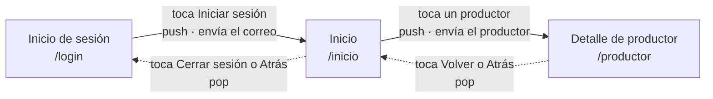

## Flujo de navegación

### Tabla de saltos

La pila se lee de abajo hacia arriba: la primera pantalla de la lista es la del fondo.

| Desde | Hacia | Acción del usuario | Método de Navigator | Datos que viajan | Pila después del salto |
|---|---|---|---|---|---|
| Inicio de sesión | Inicio | Toca el botón "Iniciar sesión" | `push`, porque es el primer salto y queremos que Login siga vivo debajo para poder volver | El correo escrito, de ida, por el constructor de `PantallaInicio` | Login → Inicio |
| Inicio | Detalle de productor | Toca la tarjeta de un productor de la lista | `push`, porque el detalle se abre encima y el Inicio debe seguir montado debajo | El productor elegido (nombre, vereda, distancia), de ida, por el constructor de `PantallaProductor` | Login → Inicio → Detalle |
| Detalle de productor | Inicio | Toca el botón "Volver" o el botón Atrás del sistema | `pop`, porque no se crea una pantalla nueva: se descarta la de encima y queda la que ya existía | Ninguno | Login → Inicio |
| Inicio | Inicio de sesión | Toca "Cerrar sesión" o el botón Atrás del sistema | `pop`, por la misma razón: Login quedó en la pila desde el primer salto | Ninguno | Login |

### Decisiones

- Elegimos el recorrido lineal Login → Inicio → Detalle en vez de una de las combinaciones sugeridas porque los datos se encadenan solos: el correo que sale del login es el que saluda el Inicio, y el productor que se toca en el Inicio es el que abre el Detalle. Así cada salto lleva un dato distinto y ninguno queda de adorno.
- En el primer salto usamos `push` y no `pushReplacement`, aunque después de iniciar sesión lo normal sería no poder volver al login. La actividad pide que desde toda pantalla salvo la primera se vuelva con `pop`, y eso obliga a dejar Login en la pila. Le dimos sentido con el botón "Cerrar sesión" del Inicio.
- El correo viaja por el constructor y no por una variable global: al ser un parámetro obligatorio, el compilador avisa si alguien abre el Inicio sin pasarlo.
- Los botones que llevan a pantallas fuera del banco (Pedidos, Alertas, Cuenta, Ver carrito) quedan sin acción.

### Ayudas usadas

- Documentación de Flutter: Navigator, ListView.builder.