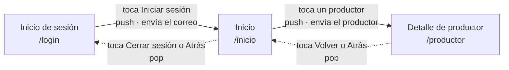

## Integrantes

| Integrante | Pantalla |
|---|---|
| David Muñoz Betancur | Detalle de productor |
| Juan Pablo Bustos Sepúlveda | Inicio de sesión |
| Anderson Fabian Sanchez Benitez | Inicio |

## Flujo de navegación

### Tabla de saltos

La pila se lee de abajo hacia arriba: la primera pantalla de la lista es la del fondo.

| Desde | Hacia | Acción del usuario | Método de Navigator | Datos que viajan | Pila después del salto |
|---|---|---|---|---|---|
| Inicio de sesión | Inicio | Toca el botón "Iniciar sesión" | `push`, porque es el primer salto y queremos que Login siga vivo debajo para poder volver | El correo escrito, de ida, por el constructor de `PantallaInicio` | Login → Inicio |
| Inicio | Detalle de productor | Toca la tarjeta de un productor de la lista | `push`, porque el detalle se abre encima y el Inicio debe seguir montado debajo | El productor elegido (nombre y vereda) y sus 4 productos, de ida, en un `Map` por el constructor de `DetalleProducto` | Login → Inicio → Detalle |
| Detalle de productor | Inicio | Toca la flecha del `AppBar` o el botón Atrás del sistema | `pop`, porque no se crea una pantalla nueva: se descarta la de encima y queda la que ya existía | Ninguno | Login → Inicio |
| Inicio | Inicio de sesión | Toca "Cerrar sesión" o el botón Atrás del sistema | `pop`, por la misma razón: Login quedó en la pila desde el primer salto | Ninguno | Login |

### Decisiones

- Elegimos el recorrido lineal Login → Inicio → Detalle en vez de una de las combinaciones sugeridas porque los datos se encadenan solos: el correo que sale del login es el que saluda el Inicio, y el productor que se toca en el Inicio es el que abre el Detalle. Así cada salto lleva un dato distinto y ninguno queda de adorno.
- En el primer salto usamos `push` y no `pushReplacement`, aunque después de iniciar sesión lo normal sería no poder volver al login. La actividad pide que desde toda pantalla salvo la primera se vuelva con `pop`, y eso obliga a dejar Login en la pila. Le dimos sentido con el botón "Cerrar sesión" del Inicio.
- El correo viaja por el constructor y no por una variable global: al ser un parámetro obligatorio, el compilador avisa si alguien abre el Inicio sin pasarlo.
- Los botones que llevan a pantallas fuera del banco (Pedidos, Alertas, Cuenta, Ver carrito) quedan sin acción.
- Todos los productores muestran los mismos 4 productos: los datos van fijos en código y lo que cambia entre un productor y otro es lo que viaja en el salto (nombre y vereda).
- En el Inicio se quitó la flecha automática del `AppBar` (`automaticallyImplyLeading: false`) para que la única salida visible sea el botón "Cerrar sesión", como dice la tabla.
- Las pantallas quedaron en carpetas distintas (`layout`, `TabsNM`, `pantallas`) porque cada integrante creó la suya por separado. No se movieron durante la navegación para no romper los imports.

### Cambios respecto al diseño

- La pantalla de detalle quedó como `DetalleProducto` y recibe un `Map` con nombre, vereda y productos, no nombre, vereda y distancia como decía la tabla. El detalle necesita los productos para listarlos, y la distancia no se envía porque el detalle no la muestra.
- El login se subió primero con `Navigator.pushNamed` y una ruta `/inicio` provisional, para poder probarlo antes de que existiera la pantalla de Inicio. En la navegación se cambió por `Navigator.push` con el correo por constructor, como dice la tabla.

### Ayudas usadas

- Claude Code (IA): para resolver errores de compilación y revisar el código, y para
  programar y probar la navegación de la pantalla Inicio. Cada parte se revisó y se entendió
  antes de commitear.
- Imágenes: fotografías tomadas de internet, usadas solo como contenido de
  demostración. Están en assets/imagenes/.
- Imágenes de las otras pantallas: el login usa una imagen de Wikimedia Commons y
  el detalle una de Google Imágenes.
- Documentación de Flutter: ListView.builder, Image.asset y declaración de assets
  en pubspec.yaml.

- Documentación de Flutter: Navigator, ListView.builder.